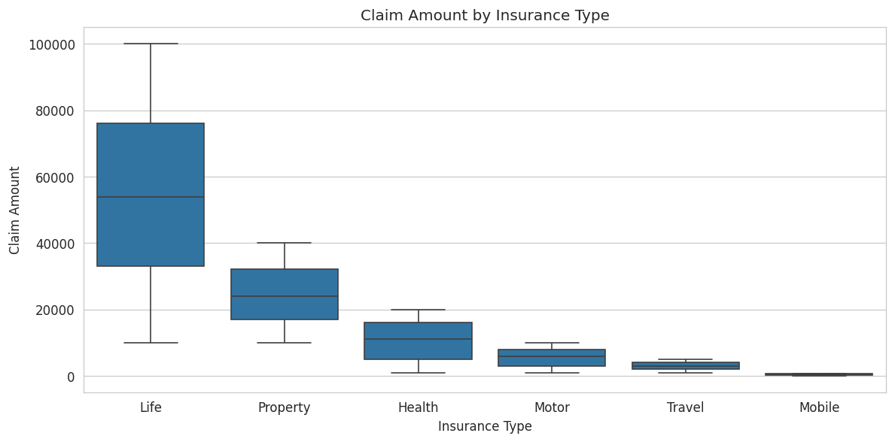
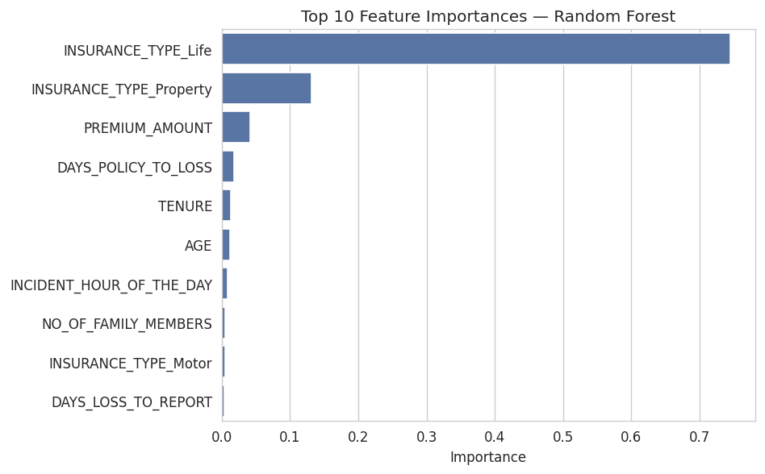
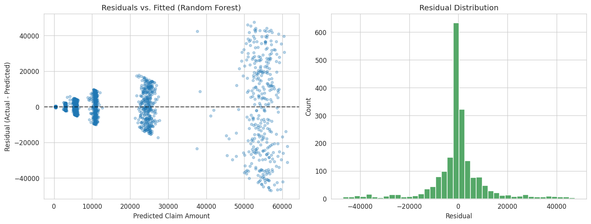
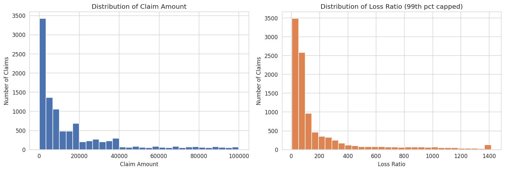

# Insurance Claims: EDA & Claim Amount Regression

Predicting insurance claim amounts from policy, customer, and incident
details — and a worked example of checking whether a tempting-looking target
column actually deserves to be modeled before building on top of it.

[](https://github.com/troisnetili/insurance-claims-analysis/actions)

## Why this project

The source dataset is named "Insurance Claims **Fraud** Data" and includes a
`CLAIM_STATUS` column that looks, at first glance, like a fraud or approval
flag worth classifying. Before building anything on it, I checked whether it
actually correlates with anything else in the data:

> A Random Forest trained on every other available feature scores **0.50 ROC
> AUC** trying to predict `CLAIM_STATUS` — exactly chance. It doesn't carry a
> learnable signal from the rest of the dataset, and isn't a sound modeling
> target.

Rather than force a fraud-classification narrative onto a column that can't
support one, this project predicts what the data *can* support well:
**claim amount** — a genuinely useful target, since flagging claims whose
amount looks unusual for a given profile is a real, practical use case for
an insurer.

## Results

| Model | RMSE | MAE | R² |
|---|---|---|---|
| Linear Regression (baseline) | ~11,960 | ~6,910 | 0.707 |
| **Random Forest** | **~11,910** | **~6,800** | **0.710** |

Both models explain roughly **70% of the variance** in claim amount using
only policy and incident details available at claim time.

<p align="center">
  
</p>

### What drives claim amount

<p align="center">
  
</p>

`INSURANCE_TYPE` dominates — claim amounts differ by an order of magnitude
across types (Life claims average in the tens of thousands; Mobile claims
average under $500), so knowing the type alone gets a model most of the way
there.

### Residual diagnostics

<p align="center">
  
</p>

Residual spread widens visibly for larger predicted amounts — the model is
more precise for typical, lower-value claims than for the largest ones. A
plain R² hides this; the residual plot doesn't.

### Exploratory findings

<p align="center">
  
</p>

One finding worth calling out: average claim amount is **nearly flat across
risk segments** (High/Medium/Low) — the current risk segmentation isn't
separating customers well by actual claims cost, while insurance type does
so by an order of magnitude.

## Project structure

```
.
├── data/                      # data/README.md has download instructions
├── notebooks/
│   └── claim_amount_analysis.ipynb   # full analysis, pre-run with outputs
├── src/                       # importable, tested pipeline code
│   ├── data_processing.py     #   load, clean, derived columns
│   ├── features.py            #   feature engineering + model table (with a leakage guard)
│   └── modeling.py            #   train / evaluate / interpret models
├── scripts/
│   └── build_notebook.py      #   rebuild the notebook from src/
├── reports/figures/           # exported chart images used in this README
├── tests/                     # pytest unit tests for src/
└── requirements.txt
```

The notebook is intentionally thin: it imports from `src/` and focuses on
analysis, plots, and commentary. The actual logic — cleaning, feature
engineering, model training — lives in tested, reusable modules rather than
being buried in notebook cells.

## Running it yourself

```bash
git clone https://github.com/troisnetili/insurance-claims-analysis.git
cd insurance-claims-analysis
pip install -r requirements.txt

# download the dataset -- see data/README.md
# then either:

pytest tests/ -v                                    # run the test suite
jupyter notebook notebooks/claim_amount_analysis.ipynb   # open the analysis
```

## Data
 See
[`data/README.md`](data/README.md) for a direct download link and setup
steps — it takes about a minute with a free Kaggle account.

## Tools

Python · pandas · NumPy · scikit-learn · matplotlib · seaborn · pytest
